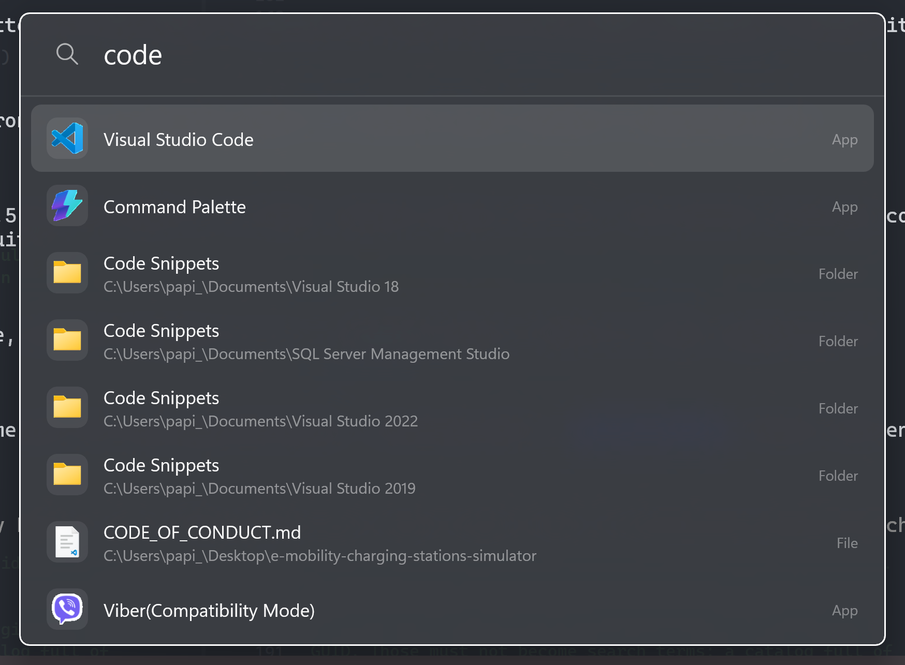

# QuickLaunch

A Spotlight-style launcher for Windows. Press the hotkey, type a few characters, press Enter.



## What works today

- **Summon from anywhere** — `Alt+Space`, falling back to `Ctrl+Alt+Space` if another app already owns it (PowerToys Run claims `Alt+Space` by default). The launcher tells you which shortcut it got.
- **Applications** — everything Windows itself lists, packaged and unpackaged, with their real shell icons.
- **Files and folders** — an in-process index of your profile, scanned in a few milliseconds per keystroke.
- **Launching** — `Enter` or click; the launcher hides first so the new window comes forward cleanly.

Not built yet: Windows Settings results, web/URL fallback, match highlighting, frecency ranking, a settings window, and MSIX packaging.

## Requirements

- Windows 11, or Windows 10 1809 and later
- .NET 10 SDK
- Windows App SDK runtime (already present on most machines)

## Build and run

```
dotnet build QuickLaunch.slnx -p:Platform=x64
dotnet run --project QuickLaunch.UI/QuickLaunch.UI.csproj -p:Platform=x64
```

`AnyCPU` is not a valid platform for this solution — always pass `-p:Platform=`.

Two switches help while developing:

| Switch | Effect |
| --- | --- |
| `--no-auto-hide` | Keeps the window up when it loses focus, so it can be inspected. |
| `--background` | Starts hidden, as the boot task will. |

## Tests

```
dotnet test QuickLaunch.Tests/QuickLaunch.Tests.csproj -p:Platform=x64
```

The suite covers matcher ranking and highlights, the file index and its snapshot format, and the search stack end to end. Several tests run against the real shell on the machine — they assert shape and plausibility rather than specific applications.

## Keyboard

| Key | Action |
| --- | --- |
| `Alt+Space` | Summon or dismiss |
| `↑` `↓` | Move the highlight, wrapping at both ends |
| `Enter` | Launch the highlighted result |
| `Esc` | Clear the query; again to dismiss |

## How it works

`QuickLaunch.Core` holds everything that is not a view: matching, ranking, the indexes and the providers. It references no WinUI types, so all of it is testable without a window. `QuickLaunch.UI` is the WinUI 3 shell — XAML, view models, and the Win32 interop that a launcher cannot avoid.

**Matching** is fzf/Sublime-style bonus scoring rather than edit distance. Launcher queries are abbreviations, not misspellings: someone types `vsc` for Visual Studio Code, so what matters is *where* the matched characters landed — at word starts, in runs, near the front — not how many edits separate the strings. A 64-bit character mask rejects hopeless candidates with a single AND before any of that runs.

**Applications** come from the shell's Applications folder, which is already the union of Start menu shortcuts, installed packages and the App Paths registry key — the same list Windows itself shows, with one launch identity and one icon source for packaged and unpackaged apps alike.

**Files** live in an index of parallel arrays rather than objects: names, parent links and character masks. Full paths are never materialised — each entry knows only its own name and its parent, so a path is rebuilt for the twenty rows shown instead of for all of them. Queries scan across cores, each partition keeping only its own best few.

Measured on a 12-core machine: 300,000 names scanned in 3–8.5 ms, with a floor of 1.5 ms when the character mask rejects everything.

**Freshness** is handled by rebuilding rather than patching — flat arrays are chosen for scan speed and do not take kindly to insertions in the middle. File system watchers only decide *when* a rebuild is worth doing. The cost is real and worth knowing: a file created seconds ago is not findable until the next rebuild lands.

### What is deliberately excluded from the file index

Hidden and system entries, which covers `AppData`, `.git` and `$Recycle.Bin`; reparse points, so junctions and OneDrive placeholders are not walked twice; and folders whose name begins with a dot. That last one matters more than it sounds: Windows marks its own machinery hidden but cross-platform tools do not, and `.vscode`, `.cargo` and `.rustup` bury real results under package caches. Excluding them took the index from 2.7 MB to 0.3 MB and the walk from 5.7 s to 2.2 s.

## Layout

```
QuickLaunch.Core/     matching, ranking, indexes, providers — no UI
QuickLaunch.UI/       WinUI 3 window, view models, Win32 interop
QuickLaunch.Tests/    xunit
```
